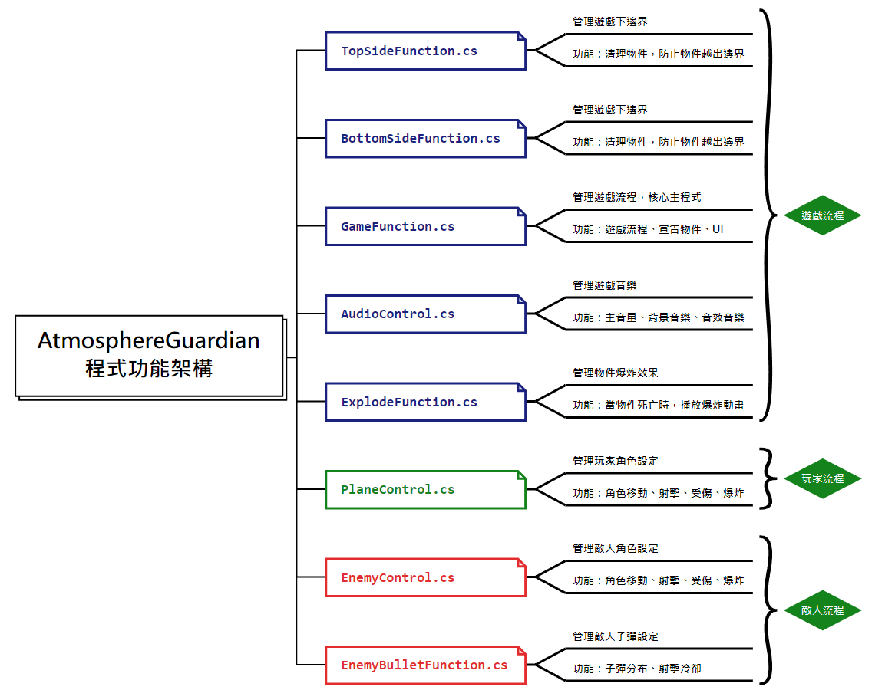

# 使用 Unity 開發的 2D 遊戲 大氣守護者 
# Unity 2D Atmosphere Guardian

使用 Unity 開發的 2D 遊戲 大氣守護者。

> 2024/05/04 啟用維護，參見[日誌](#日誌)。

- #### 範例圖片

- #### 範例影片
    - [The game ''Atmosphere Guardian'' based on Unity Engine development](https://youtu.be/SiFJWF6zFwU)  
    - [基於 Unity 遊戲引擎開發的「Atmosphere Guardian」加強版 Part-1](https://youtube.com/shorts/4dj__XmSZZE)  
    - [基於 Unity 遊戲引擎開發的「Atmosphere Guardian」遊戲片段 Part-3](https://youtu.be/Wn6BF8Pj23s)  
    - [基於 Unity 遊戲引擎開發的「Atmosphere Guardian」遊戲片段 Part-2](https://youtu.be/kKCW022EA4A)  
    - [基於 Unity 遊戲引擎開發的「Atmosphere Guardian」遊戲片段 Part-1](https://youtu.be/B9STl2F7eLI)  
    - [基於 Unity 遊戲引擎開發的「Atmosphere Guardian」遊戲專題講解](https://youtu.be/XN4A198IYQA)  

---

## 目錄
- [目錄](#目錄)
- [開發環境](#開發環境)
- [如何執行](#如何執行)
- [版本差異](#版本差異)
- [日誌](#日誌)
- [貢獻](#貢獻)
- [著作權](#著作權)

---

## 開發環境

- Windows Home 10 64bit
- C# `6.0.300`
- Unity `2021.3.1f1`
- Visual Studio Code `2017` Community

---

## 如何執行

> 預設 ***Windows Home 10 64bit*** 作業系統  

步驟 一：執行。  

- 方法一：下載任意版本，最好是 **Atmosphere Guardian v7-Final-Pro**  
>
- 方法二：點兩下 `AtmosphereGuardian.exe`
---

## 版本差異

| 版本 | 描述 |
| :--: | ---- |
| v1.0 | 現階段已完成。 |

---

## 日誌

| 時間 | 事件 |
| :--: | ---- |
| 2024/05/04 | 資料救援回復 **2022** 編輯紀錄，重新開始維護！ |

---

## 貢獻

獨立開發。 

---

## 著作權

此專案受到 [GPL-3.0](https://www.gnu.org/licenses/gpl-3.0.zh-tw.html) 保障。  
Copyright © 2022-2024 zong zong ( zongzong0408 )
